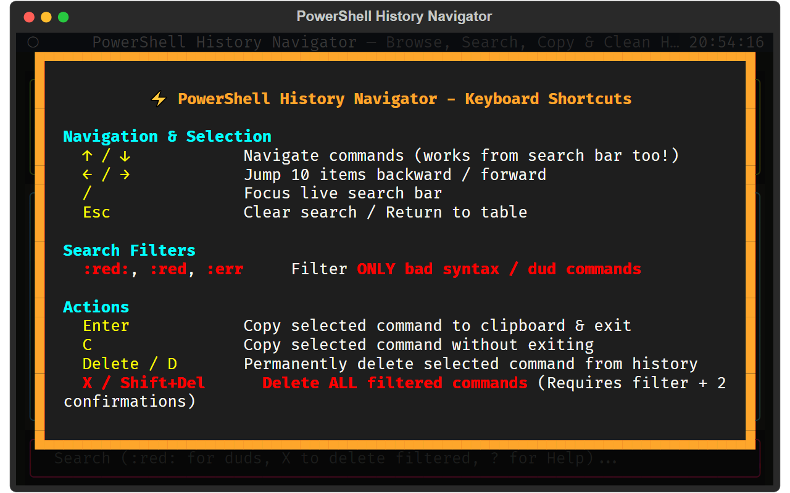

<div align="center">


# PowerShell History Navigator & Cleaner (TUI)

**A high-performance terminal UI for inspecting, searching, syntax-validating, and pruning PowerShell history.**

[](https://www.python.org/)
[](https://textual.textualize.io/)
[](https://learn.microsoft.com/en-us/powershell/)
[](./LICENSE)

[Features](#-key-features) • [The Origin Story](#-why-this-exists-the-origin-story) • [Architecture Deep-Dive](#-under-the-hood-for-engineers--ai-agents) • [Installation](#-quickstart--installation) • [Keybindings](#-keyboard-shortcuts)

</div>

---

## ⚡ The Origin Story: Why This Exists

If you use PowerShell heavily, you have likely encountered this infuriating terminal bug:

1. You paste a multi-line script, a large JSON payload, or an authentication token into the console.
2. Later, you press **`Up Arrow`** or use **`Ctrl + R` (Reverse Search)** to recall a previous command.
3. Suddenly, PowerShell's **PSReadLine** hits that multi-line monster: the cursor jumps unpredictably across console rows, overwriting previous lines and getting stuck in an infinite visual loop between 2–3 commands.
4. Because PSReadLine saves all commands directly to disk (`ConsoleHost_history.txt`), **this glitch persists across terminal restarts and never goes away on its own.**

**PowerShell History Navigator** was engineered to solve this permanently. It provides a dedicated, lightweight, and responsive Terminal User Interface (TUI) to browse, search, copy, and surgically remove problematic commands from history on disk.

---

## ✨ Key Features

- **⚡ Latest-First Ordering**: Inspect your command stream starting from your most recent command at the very top, flowing naturally into the past.
- **🔍 Instant Live Search & Filter**: Real-time incremental search bar docked at the bottom of the screen.
- **🔴 Bad Syntax & Dud Detection (`:red:`)**: Proprietary state-machine analyzer identifies syntax errors, broken quotes, unmatched brackets, and accidental mouse-pasted CLI stack traces, highlighting them in bold red. Type `:red:` in search to isolate all duds.
- **🗑️ Surgical & Bulk History Purging**:
  - Delete individual commands with `Delete` or `D`.
  - Delete **all filtered commands** at once with `X` (safeguarded by active filter requirements and double confirmation modals).
- **🎨 Dual Theme Palette (`T`)**: Switch dynamically between **Monokai** and **Dracula** color schemes with full token syntax highlighting.
- **📝 Editor Integration (`E`)**: One-key jump directly into **Sublime Text**, VS Code, or your default text editor.
- **📋 Direct Clipboard Copy (`Enter` / `C`)**: Hit `Enter` to copy the selected command to your Windows clipboard and exit immediately.
- **⌨️ On-Screen Keymap Overlay (`?` / `H` / `F1`)**: Modal shortcut cheat-sheet accessible at any moment.

---

## 📸 Screenshots & Layout

```
┌────────────────────────────────────────────────────────────────────────┐
│  ⚡ Command Preview (#4748 - 54 chars)                                 │
│  Get-ChildItem -Path C:\Projects -Recurse | Where-Object Length -gt 1MB│
├────────────────────────────────────────────────────────────────────────┤
│  #     Len   Command                                                   │
│  4748  74    Get-ChildItem -Path C:\Projects -Recurse | Where-Object...│
│  4747  18    git status                                                │
│  4746  32    python -m pytest tests/unit                               │
│  4745  104   ✖ At line:10 char:1 + CategoryInfo : ObjectNotFound       │
│  4744  26    npm run build --prefix frontend                           │
├────────────────────────────────────────────────────────────────────────┤
│ > Type to search history (:red: for duds, X to delete filtered, ? Help)│
└────────────────────────────────────────────────────────────────────────┘
```

---

## 🧠 Under the Hood: For Engineers & AI Agents

### 1. PSReadLine History Storage Semantics
PowerShell's PSReadLine module writes command history to:
`$env:APPDATA\Microsoft\Windows\PowerShell\PSReadLine\ConsoleHost_history.txt`

- **Single-Line Commands**: Written as plain text lines separated by standard CRLF/LF.
- **Multi-Line Commands**: Written with trailing backticks (`` ` ``) at the end of each line as a continuation token, terminated by the closing line without a backtick.
- **Rendering Artifacts**: When PSReadLine encounters deep multi-line blocks or malformed escape sequences during console history cycling, its internal buffer coordinate calculations break relative to Windows Terminal / ConHost viewports.
- **Persistence Sync**: This tool directly manipulates and rewrites `ConsoleHost_history.txt` using strict UTF-8 (`utf-8` without BOM) to ensure 100% compatibility with PSReadLine without file corruption.

### 2. Dud & Syntax Error Classifier (State Machine)
Rather than executing untrusted past commands in a live shell, the TUI runs a deterministic lexical analysis state machine (`is_dud_command`):
1. **Traceback & Error Scraping**: Detects PowerShell error headers (`+ CategoryInfo`, `+ FullyQualifiedErrorId`, `At line:`, `: The term '...' is not recognized`).
2. **Caret & Underline Artifacts**: Matches copied CLI diagnostic indicators (`^^^^^`, `+ ~~~~~~`).
3. **Leading Punctuation Faults**: Flags commands starting with invalid leading delimiters (`;`, `|`, `,`, `}`, `)`).
4. **Balanced Delimiter & Quote Lexer**: Tracks single quotes (`'`), double quotes (`"`), PowerShell backtick escapes (`` ` ``), and nested bracket stacks (`()`, `[]`, `{}`) while respecting quote isolation (e.g., `'` inside `""` is treated as literal text).

### 3. Non-Blocking Editor Dispatch
When launching editors (e.g., Sublime Text via `$env:EDITOR`), the tool utilizes `shlex.split` to parse environment variables, strips blocking flags (`--wait` / `-w`), and resolves binary paths across Windows standard installation directories before dispatching asynchronous child processes via `subprocess.Popen`.

---

## 🚀 Quickstart & Installation

### Prerequisites
- Python 3.10 or higher
- PowerShell 5.1 / PowerShell 7+ on Windows

### 1. Clone the Repository
```powershell
git clone https://github.com/eloqven/powershell-history-navigator.git
cd powershell-history-navigator
```

### 2. Install Dependencies
```powershell
pip install -r requirements.txt
```

### 3. Run the Navigator
```powershell
python history_tui.py
```
*(or execute `./run_history_tui.ps1`)*

---

## ⚡ Add a Global `hist` Command in PowerShell

Add a quick alias to your PowerShell `$PROFILE` so you can launch the navigator from any terminal window by typing `hist`:

```powershell
if (!(Test-Path $PROFILE)) { New-Item -Path $PROFILE -ItemType File -Force }
Add-Content $PROFILE @"

function hist { python "D:\powershell-history-navigator\history_tui.py" }
"@
```

---

## 📸 Interface Preview (with Shortcut Keys Modal)

<div align="center">



*Press `?`, `H`, or `F1` at any time inside the TUI to toggle the on-screen shortcut cheatsheet.*

</div>

---

## ⌨️ Keyboard Shortcuts

| Key | Action | Description |
|:---|:---|:---|
| `↑` / `↓` | **Navigate** | Move through commands (works directly from the search bar too!) |
| `←` / `→` | **Jump Page** | Jump 10 items backward / forward |
| `/` | **Focus Search** | Jump straight into the live search input box |
| `Esc` | **Clear / Unfocus** | Clear search input or return focus to the history table |
| `:red:` | **Dud Filter** | Type `:red:` in search to filter **only** bad syntax / error commands |
| `Enter` | **Copy & Exit** | Copy selected command to Windows clipboard and exit TUI |
| `C` | **Copy Only** | Copy selected command to clipboard without closing TUI |
| `Delete` / `D` | **Delete Single** | Permanently delete the selected command from history on disk |
| `X` / `Shift+Del` | **Bulk Delete** | Permanently delete **all currently filtered** commands (requires 2 confirmations) |
| `E` / `O` | **Open in Editor** | Open `ConsoleHost_history.txt` directly in Sublime Text / Default Editor |
| `T` | **Toggle Theme** | Switch color palette between **Monokai** and **Dracula** |
| `R` | **Reload** | Re-read history file from disk to sync new commands |
| `?` / `H` / `F1` | **Help Overlay** | Open on-screen keybinding cheat-sheet |
| `Q` | **Quit** | Close the application |

---

## 🛡️ Safety & Data Integrity

- **Automatic Backups**: Modifying or cleaning history writes safely to `ConsoleHost_history.txt`.
- **Bulk Deletion Safeguard**: The bulk delete command (`X`) is strictly blocked when all commands are visible, preventing accidental full wipes.
- **Double Confirmation**: Any batch deletion requires explicitly passing through two confirmation modals before touching disk storage.

---

## 📄 License

This project is licensed under the [MIT License](./LICENSE).
